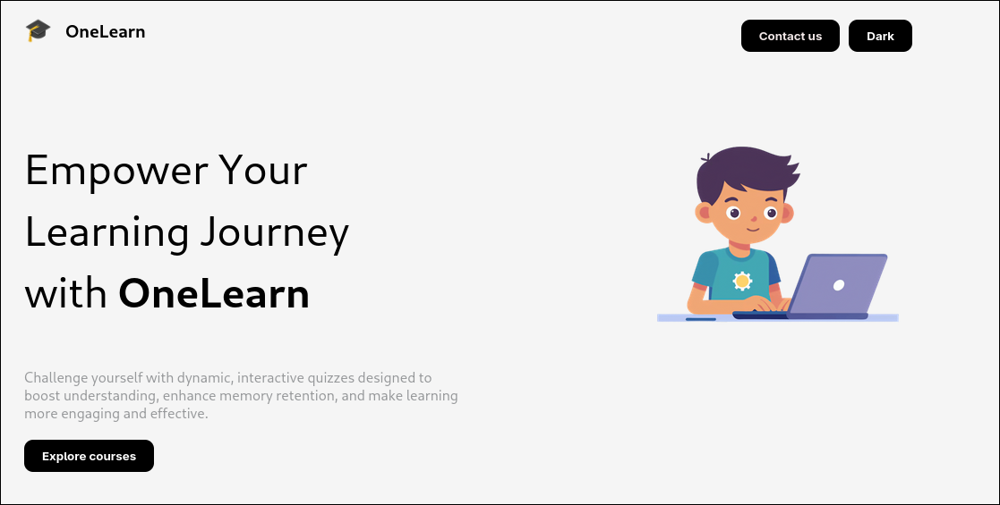
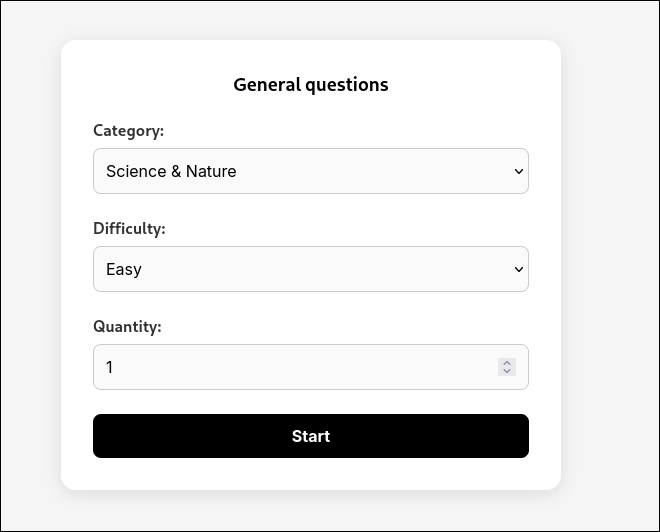
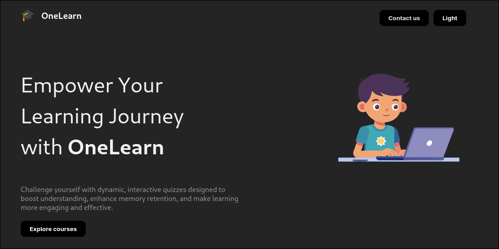

# OneLearn

OneLearn is a modern web application for interactive learning and quizzes. Built with React and Express, it helps users challenge themselves, track progress, and explore educational content.

---

## Features

- **Interactive Quizzes:** Choose category, difficulty, and number of questions.
- **Live Score Tracking:** See your results instantly.
- **Dark Mode:** Switch between light and dark themes.
- **Course Videos:** Explore curated YouTube videos for programming topics.
- **Contact & About Sections:** Learn about the team and get in touch.

---

## Screenshots





---

## Getting Started

### Prerequisites

- Node.js (v18+ recommended)
- npm

### Installation

1. **Clone the repository:**
    ```sh
    git clone https://github.com/OmarSherif06/onelearn.git
    cd onelearn
    ```

2. **Install dependencies for frontend and backend:**
    ```sh
    cd frontend
    npm install
    cd ../api
    npm install
    ```

### Running the App

1. **Start the backend server:**
    ```sh
    cd api
    npm start
    ```
    The backend runs on [http://localhost:3001](http://localhost:3001).

2. **Start the frontend development server:**
    ```sh
    cd ../frontend
    npm start
    ```
    The frontend runs on [http://localhost:3000](http://localhost:3000).

---

---

## Team

**Frontend:** Abdelrahman Hany, Omar Ali, Omar Walid  
**Backend:** Abdalla Hany, Omar Sherif

---
